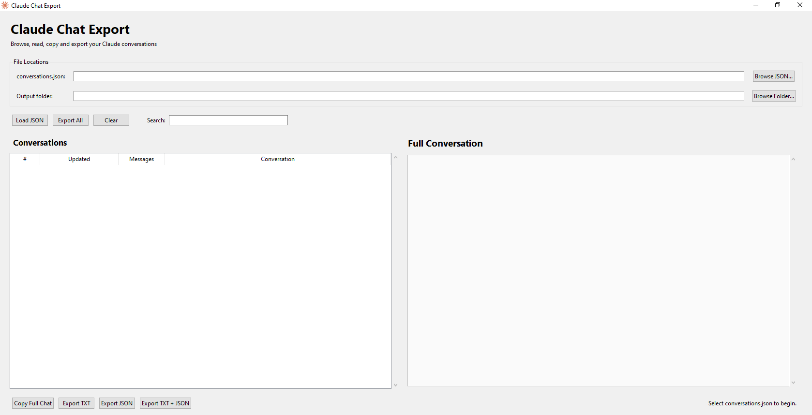

Claude Chat Export

A lightweight Windows desktop application for browsing and exporting conversations from a Claude conversations.json export.

It provides a simple graphical interface for selecting a Claude export file, browsing conversations, reading the complete conversation, and exporting individual or all conversations to TXT and JSON.

Features
📂 Select conversations.json from any location
📁 Select a custom output folder
🔎 Search conversations by title or UUID
💬 Browse all conversations in a graphical interface
📜 Read the complete conversation with vertical scrolling
👤 Clearly separates User and Claude messages
🕒 Displays message timestamps
🌳 Handles Claude conversation branches
📄 Export individual conversations to TXT
🗂️ Export individual conversations to JSON
📦 Export all conversations at once
📋 Copy the complete conversation to the clipboard
🪟 Windows GUI — no command-line interaction required
🎨 Custom Claude application icon
📦 Can be compiled into a standalone Windows .exe
🔒 Runs locally — your conversation data is not uploaded anywhere
Important

This project is a local utility.

Your Claude export is processed on your computer. The application does not send your conversations to a server.

Getting Your Claude Export

First, export your Claude data using the official Claude data export functionality.

The export normally contains a file similar to:

conversations.json

The application can load this file directly.

You do not need to place conversations.json next to the application.

For example:

C:\Users\YourName\Downloads\claude-export\conversations.json

is perfectly fine.

Windows Executable

If you only want to use the application, you can use the pre-built Windows executable from the project's GitHub Releases page.

Download:

Claude Chat Export.exe

and run it.

No Python installation is required when using the compiled executable.

Using the Application
1. Select the JSON file

Click:

Browse JSON...

and select your Claude export:

conversations.json

The application will automatically load the conversations.

2. Select an output folder

Click:

Browse Folder...

and choose where exported conversations should be saved.

For example:

C:\Users\YourName\Desktop\Claude Exports

3. Browse conversations

The left panel displays:

Conversation number
Last updated date
Message count
Conversation title

Click any conversation to display it.

4. Read the complete conversation

The right panel contains the complete conversation.

You can scroll through the entire conversation using the scrollbar or mouse wheel.

There is no preview truncation such as:

...preview truncated...

The application displays the complete readable conversation.

Export Options
Export TXT

Exports the selected conversation as a plain text file.

Example:

20260830_024805_a2724458_Build_production_ready.txt

The TXT file contains:

==========================================================================================
Build production ready
==========================================================================================

UUID: a2724458-44d1-43b5-9ab4-b0ffd0ffcb59
CREATED: 2026-08-19 13:41:46
UPDATED: 2026-08-30 02:48:05
MESSAGE COUNT: 78

==========================================================================================
1. USER
2026-08-19 13:41:48
------------------------------------------------------------------------------------------
Build Production ready

==========================================================================================
2. CLAUDE
2026-08-19 13:46:03
------------------------------------------------------------------------------------------
...

Export JSON

Exports the conversation as JSON while preserving the conversation structure.

This is useful if you want to process the conversations with another script or application.

Export TXT + JSON

Exports both formats at the same time.

Export All

Exports every conversation in the loaded conversations.json.

For example:

Claude Exports/
│
├── 20260830_024805_a2724458_Build_production_ready.txt
├── 20260830_024805_a2724458_Build_production_ready.json
├── 20260829_041700_12345678_Conversation.txt
├── 20260829_041700_12345678_Conversation.json
└── ...

Conversation Branches

Claude exports can contain branching/retry message structures.

The application attempts to reconstruct the active conversation path instead of simply dumping every branch into the exported conversation.

This helps prevent duplicate or superseded messages from appearing in the exported result.

If your export contains an unusual or malformed conversation structure, the application falls back to chronological processing where possible.

Running From Source
Requirements
Windows
Python 3.9 or newer
Tkinter

Tkinter is normally included with the standard Windows Python installer.

No external Python packages are required to run the application itself.

Check Python
python --version

Example:

Python 3.11.9

Run the Application

Clone the repository:

git clone https://github.com/YOUR_USERNAME/claude-chat-export.git

Enter the directory:

cd claude-chat-export

Run:

python claude_chat_export.py

Building the Windows EXE

Install PyInstaller:

python -m pip install pyinstaller

Build the application:

python -m PyInstaller --clean --onefile --windowed --icon="claude.ico" --add-data="claude.ico;." --name="Claude Chat Export" claude_chat_export.py

The executable will be created here:

dist\
└── Claude Chat Export.exe

The ICO file is bundled into the executable, so the final application does not need claude.ico beside it.

Project Structure
claude-chat-export/
│
├── claude_chat_export.py
├── claude.ico
├── requirements.txt
├── README.md
├── LICENSE
├── .gitignore
│
├── assets/
│   └── screenshot.png
│
└── .github/
    └── workflows/
        └── build-windows.yml

Privacy

This application is designed to process your exported Claude data locally.

It does not:

Upload conversations
Send conversations to a third-party API
Store conversations in an online database
Require an account
Require an internet connection for normal operation

Your exported JSON remains on your computer unless you choose to upload or share it yourself.

Security

Do not upload your personal conversations.json to this GitHub repository.

Claude exports may contain private information, credentials, personal conversations, source code, documents, or other sensitive material.

Before publishing anything to GitHub, make sure your repository contains only the application source code and non-sensitive example files.

Troubleshooting
No module named _curses

This project does not require the Python curses module.

The graphical version uses Tkinter and is intended to work natively on Windows.

If you are using an older version of the project that imports:

import curses

replace it with the current GUI version.

The JSON file is somewhere else

That's supported.

Use:

Browse JSON...

and select the file directly.

The file does not have to be in the application directory.

The output folder is somewhere else

That's also supported.

Use:

Browse Folder...

to select any writable folder.

EXE icon looks incorrect

Windows Explorer can cache executable icons.

Try:

Close the application.
Rename the EXE.
Rebuild using the PyInstaller command above.
Restart Windows Explorer if necessary.

The build command uses both:

--icon="claude.ico"

and:

--add-data="claude.ico;."

The first sets the Windows executable icon.

The second bundles the icon so the application can use it at runtime.

Contributing

Contributions are welcome.

If you find a bug or have an improvement:

Open an issue.
Describe the problem or proposed feature.
Include reproduction steps when reporting a bug.
Submit a pull request if you have a fix.

Please do not include real/private Claude conversations in issues or pull requests.

Use anonymized example data instead.

Disclaimer

This project is an independent community utility and is not affiliated with or endorsed by Anthropic.

Claude is a trademark of Anthropic PBC.

This application is intended for working with data that you have legitimately exported and have permission to process.

License

This project is released under the MIT License.

See LICENSE for details.

:::

This also fixes your **Project Structure** issue: the tree is now inside a fenced `text` block, so GitHub will preserve every line and indentation.
